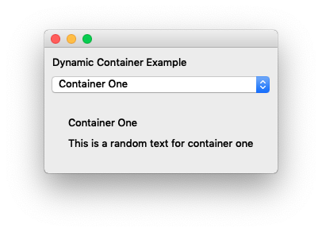
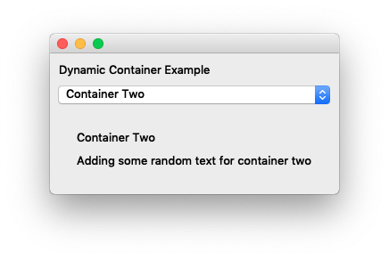

<br>

There are numerous ways to build applications, especially in today's time, as there are plentiful libraries and tools available on the web. To name a few, we can use django, pyramid, and even flask for simpler apps. This article focuses on building desktop apps with Enaml. Enaml is a library to build desktop apps with minimal effort. You might ask why? Why in this day and age would you ever build a desktop app? Hey why not, every project has its requirements and constrainsts.

Here is what we need installed on the computer:
* Miniconda and a conda environment
* latest version of python
* pandas


<br>

Installing enaml
--
Enaml can be installed using `conda` with an easy command.

```bash
> conda install enaml

The following packages will be downloaded:

    package                    |            build
    ---------------------------|-----------------
    python.app-2               |           py36_9         1.3 MB
    certifi-2018.8.24          |           py36_1         139 KB
    atom-0.4.1                 |   py36h0a44026_0         107 KB
    openssl-1.0.2p             |       h1de35cc_0         3.4 MB
    ply-3.11                   |           py36_0          79 KB
    qtpy-1.5.1                 |           py36_0          53 KB
    kiwisolver-1.0.1           |   py36h0a44026_0          56 KB
    future-0.16.0              |           py36_2         668 KB
    enaml-0.10.2               |   py36h0a44026_0         961 KB
    ------------------------------------------------------------
                                           Total:         6.7 MB

```
Congrats! You now have enmal installed on your conda environment.

<br>

Folder Structure
--
First create a new folder. And then add initial files using `touch` and `mkdir` commands.

```bash
> mkdir dyn_container_enaml
> cd dyn_container_enaml
> touch main.py
...
```
After completion, the folder structure would looks something like this:

```bash
> tree dyn_container_enaml/
dyn_container_enaml/
├── main.py
└── src/
    ├── app_layout.enaml
    ├── app_model.py
    ├── container_one/
    │   ├── container_one_layout.enaml
    │   └── container_one_model.py
    └── container_two/
        ├── container_two_layout.enaml
        └── container_two_model.py

3 directories, 7 files
```
*Note `tree` is a bash command which can be installed using homebrew package for mac os.
`brew install tree`

<br>

Hello, Enaml!
--
The code in these files is where python will spin off the enaml application. 
So lets get started with some coding!

```python
# main.py

import enaml
import traceback
from src.app_model import AppMain
from enaml.qt.qt_application import QtApplication

# enaml.imports is a gateway to import enaml files as they
# are not part of python. Enaml is a superset of python.
with enaml.imports():
    from src.app_layout import App

try:
    # create a Qt application
    app = QtApplication()

    # define a new view for enaml object
    view = App

    # set the attribute of enaml object to a python object
    App.model = AppMain()

    # initialize the enaml view and call show
    view().show()

    # then start the Qt Application
    app.start()

except:
    print(traceback.format_exc())
```
<br>

```python
# app_layout.enaml

from enaml.widgets.api import Window, Container, Label

# create a new enaml Window object
enamldef App(Window):

    # create an attribute model which gets set in main.py
    # Note: the model can also be instantiated here after
    # import of the python object.
    attr model
    # attr model = AppMain() # import app_model
    
    # container has a label with the message
    Container:
        Label:
            text = "Hello, Enaml!"
```
<br>

```python
# app_model.py

class AppMain(object):
    pass
```

Here is what the output of the app looks like thus far!
<center></center>


Adding ComboBox in UI
--
Time to add some combo boxes so that we can switch between different containers. Lets start by importing ComboBox widget in enaml and adding it to the container. Next we will change the python object to be that of Atom and then add some other properties which are refrenced in enaml layout. See the code below for more details.

```python
# app_layout.enaml

from enaml.widgets.api import Window, Container, Label, ComboBox

# create a new enaml Window object
enamldef App(Window):

    # create an attribute model which gets set in main.py
    # Note: the model can also be instantiated here after
    # import of the python object.
    attr model
    # attr model = AppMain() # import app_model
    
    Container:
        # container has a label with a title getting set from
        # model property
        Label:
            text << model.title

        # container has a combo box to switch containers for 
        # different modules. Note: the '<<' which implies the
        # model has a property called containers which is
        # getting set.
        ComboBox:
            items << model.containers
```
<br>

```python
# app_model.py

from atom.api import Atom, Value

class AppMain(Atom):
    
    # property has a CAtom object of Value as it is needed
    # to work with enaml superset
    title = Value('Dynamic Container Example')

    # containes are defined here as None
    containers = Value()

    def __init__(self):
        # when the object is initialized, the value for 
        # containers is set
        self.containers = ['Container One', 'Container Two']
```

After these edits, the app looks something like this. Progress!
<center></center>

<br>

Enaml Include other Container Models/Layouts
--
At this point, we want to make it such that when we select an item from the dropdown, we render a different container in the bottom. This is possible due to enaml `include` code api. It lets us remove/add widgets dynamically through python code. Final mile!

Lets start by adding something for each model (One and Two) including the layouts.

```python
# container_one_layout.enaml

from enaml.widgets.api import Container, Label

enamldef ContainerOneLayout(Container):

    # create an attribute model which gets set through code
    attr model
    
    Container:
        Label:
            text << model.title
        Label:
            text = 'This is a random text for container one'
```
<br>

```python
# container_one_model.py

from atom.api import Atom, Value

class ContainerOne(Atom):
    title = 'Container One'
```
<br>

```python
# container_two_layout.enaml

from enaml.widgets.api import Container, Label

enamldef ContainerTwoLayout(Container):

    # create an attribute model which gets set through code
    attr model
    
    Container:
        Label:
            text << model.title
        Label:
            text = 'Adding some random text for container two'
```
<br>

```python
# container_two_model.py

from atom.api import Atom, Value

class ContainerTwo(Atom):
    title = 'Container Two'
    
```

Next up, lets add in the locations of the containers and models in the app_model.py and refrence the keys of the model layout as a list to the containers. From here when a user selects a value from the dropdown, we will render a different layout and model, respectively.

```python
# app_model.py

from atom.api import Atom, Value

# import all container models
from src.container_one.container_one_model import ContainerOne
from src.container_two.container_two_model import ContainerTwo

# import all container layouts
import enaml
with enaml.imports():
    from src.container_one.container_one_layout import ContainerOneLayout
    from src.container_two.container_two_layout import ContainerTwoLayout


# create a new list which represents the objects for model and layout
MODEL_LAYOUTS = \
{
    'Container One': \
    {
        'model'     : ContainerOne,
        'layout'    : ContainerOneLayout
    },
    'Container Two': \
    {
        'model'     : ContainerTwo,
        'layout'    : ContainerTwoLayout
    }
}

class AppMain(Atom):
    
    # property has a CAtom object of Value as it is needed
    # to work with enaml superset
    title = Value('Dynamic Container Example')

    # containes are defined here as None
    containers = Value()

    # container to render once an item is selected through
    # the dropdown
    selectedContainer = Value([])

    def __init__(self):
        # when the object is initialized, the value for 
        # containers is set. In this case, the value 
        # consists of keys rendered from the model layout
        # dictionary
        self.containers = list(MODEL_LAYOUTS.keys())

    def renderContainer(self, key):
        pass
```
<br>

```python
# app_layout.enaml

from enaml.core.api import Include
from enaml.widgets.api import Window, Container, Label, ComboBox

# create a new enaml Window object
enamldef App(Window):

    # create an attribute model which gets set in main.py
    # Note: the model can also be instantiated here after
    # import of the python object.
    attr model
    # attr model = AppMain() # import app_model
    
    Container:
        # container has a label with a title getting set from
        # model property
        Label:
            text << model.title

        # container has a combo box to switch containers for 
        # different modules. Note: the '<<' which implies the
        # model has a property called containers which is
        # getting set.
        # Note: dropdown is given as a name for this ComboBox
        # so that it can be refrenced later.
        ComboBox: dropdown:
            items << model.containers

            # selected_item is a propery of ComboBox which returns
            # the selected item. The '::' implied notification which
            # can be used to execute python code and call a function
            # on the model property.
            selected_item ::
                print(dropdown.selected_item)
                # this function will render a different container
                # on UI by calling the model's function
                model.renderContainer(dropdown.selected_item)

        # Include is the core api widget that lets applications
        # define the objets being added/removed dynamically
        # through python. The objects which is a list is 
        # currently pointing to selectedContainer in model.
        Include: dynamicContainers:
            objects << model.selectedContainer
```

Final touches...implementing the `renderContainer` function

```python
# app_model.py

from atom.api import Atom, Value
import traceback

# import all container models
from src.container_one.container_one_model import ContainerOne
from src.container_two.container_two_model import ContainerTwo

# import all container layouts
import enaml
with enaml.imports():
    from src.container_one.container_one_layout import ContainerOneLayout
    from src.container_two.container_two_layout import ContainerTwoLayout


# create a new list which represents the objects for model and layout
MODEL_LAYOUTS = \
{
    'Container One': \
    {
        'model'     : ContainerOne,
        'layout'    : ContainerOneLayout
    },
    'Container Two': \
    {
        'model'     : ContainerTwo,
        'layout'    : ContainerTwoLayout
    }
}

class AppMain(Atom):
    
    # property has a CAtom object of Value as it is needed
    # to work with enaml superset
    title = Value('Dynamic Container Example')

    # containes are defined here as None
    containers = Value()

    # container to render once an item is selected through
    # the dropdown
    selectedContainer = Value([])

    def __init__(self):
        # when the object is initialized, the value for 
        # containers is set. In this case, the value 
        # consists of keys rendered from the model layout
        # dictionary
        self.containers = list(MODEL_LAYOUTS.keys())

    def renderContainer(self, key):
        """
        Render a container for the given key
        """
        if key is None:
            self.selectedContainer = []

        if key not in MODEL_LAYOUTS:
            self.selectedContainer = []

        if key in MODEL_LAYOUTS:
            try:
                # get the layout
                container = MODEL_LAYOUTS.get(key).get('layout')

                # set the model attr of layout to the model
                container.model = MODEL_LAYOUTS.get(key).get('model')

                # set the selected container to the container and
                # initialize the layout
                self.selectedContainer = [container()]
            except:
                traceback.format_exc()
```
<br>

Final Results
--
Both the containers are rendered as a selection is made on the UI. Images Below.

**Container One**<br>

<br>

**Container Two**<br>
