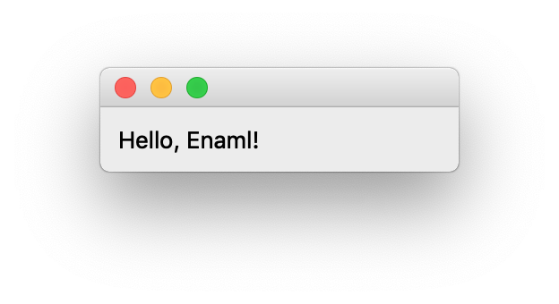

<br>

There are numerous ways to build applications, especially in today's time, as there are plentiful libraries and tools available on the web. To name a few, we can use django, pyramid, and even flask for simpler apps. This article focuses on building desktop apps with Enaml. Enaml is a library to build desktop apps with minimal effort. You might ask why? Why in this day and age would you ever build a desktop app? Hey why not, every project has its requirements and constrainsts.

Here is what we need installed on the computer:
* Miniconda and a conda environment
* latest version of python
* pandas


<br>

Installing enaml
--
Enaml can be installed using `conda` with an easy command.

```bash
> conda install enaml

The following packages will be downloaded:

    package                    |            build
    ---------------------------|-----------------
    python.app-2               |           py36_9         1.3 MB
    certifi-2018.8.24          |           py36_1         139 KB
    atom-0.4.1                 |   py36h0a44026_0         107 KB
    openssl-1.0.2p             |       h1de35cc_0         3.4 MB
    ply-3.11                   |           py36_0          79 KB
    qtpy-1.5.1                 |           py36_0          53 KB
    kiwisolver-1.0.1           |   py36h0a44026_0          56 KB
    future-0.16.0              |           py36_2         668 KB
    enaml-0.10.2               |   py36h0a44026_0         961 KB
    ------------------------------------------------------------
                                           Total:         6.7 MB

```
Congrats! You now have enmal installed on your conda environment.

<br>

Folder Structure
--
First create a new folder. And then add initial files using `touch` and `mkdir` commands.

```bash
> mkdir dyn_container_enaml
> cd dyn_container_enaml
> touch main.py
...
```
After completion, the folder structure would looks something like this:

```bash
> tree dyn_container_enaml/
dyn_container_enaml/
├── main.py
└── src/
    ├── app_layout.enaml
    ├── app_model.py
    ├── container_one/
    │   ├── container_one_layout.enaml
    │   └── container_one_model.py
    └── container_two/
        ├── container_two_layout.enaml
        └── container_two_model.py

3 directories, 7 files
```
*Note `tree` is a bash command which can be installed using homebrew package for mac os.
`brew install tree`

<br>

Hello, Enaml!
--
The code in these files is where python will spin off the enaml application. 
So lets get started with some coding!

```python
# main.py

import enaml
import traceback
from src.app_model import AppMain
from enaml.qt.qt_application import QtApplication

# enaml.imports is a gateway to import enaml files as they
# are not part of python. Enaml is a superset of python.
with enaml.imports():
    from src.app_layout import App

try:
    # create a Qt application
    app = QtApplication()

    # define a new view for enaml object
    view = App

    # set the attribute of enaml object to a python object
    App.model = AppMain()

    # initialize the enaml view and call show
    view().show()

    # then start the Qt Application
    app.start()

except:
    print(traceback.format_exc())
```
<br>

```python
# app_layout.enaml

from enaml.widgets.api import Window, Container, Label

# create a new enaml Window object
enamldef App(Window):

    # create an attribute model which gets set in main.py
    # Note: the model can also be instantiated here after
    # import of the python object.
    attr model
    # attr model = AppMain() # import app_model
    
    # container has a label with the message
    Container:
        Label:
            text = "Hello, Enaml!"
```
<br>

```python
# app_model.py

class AppMain(object):
    pass
```

Here is what the output of the app looks like thus far!
